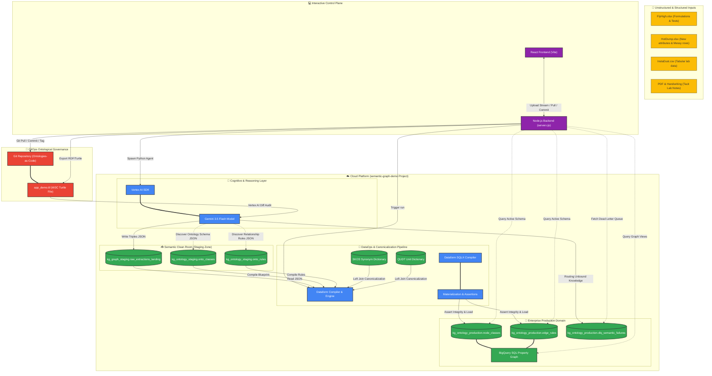

# Enterprise Semantic Knowledge Graph — Cloud Platform Architecture

This document describes the enterprise-grade architecture of the **Enterprise Enterprise (Enterprise Adhesive Technologies) Semantic Knowledge Graph Platform**. The system functions as a **Semantic Clean Room**, combining state-of-the-art Generative AI with structured BigQuery analytics and Dataform pipeline automation to achieve automated ontology generation, rigorous data canonicalization, and real-time knowledge graph serving.

---

## 🏗️ End-to-End System Architecture

The following Mermaid diagram visualizes the flow of data and schemas through the system, detailing how raw document files are transformed into an active property graph model and synchronized back to code repositories.



---

## ⚙️ Core GCP Components & Roles

### 1. Vertex AI (`gemini-3.5-flash`)
**Gemini 3.5 Flash** acts as the cognitive center of the system. It handles ingestion parsing, schema generation, relationship extraction, and ontological audit reviews:
*   **Multimodal File Ingestion Parser:** Parses Excel workbooks directly into high-fidelity markdown representations (preserving physical sheet layouts, grids, columns, and rows). Ingests PDFs, images of handwritten notes, and CSV tabular datasets directly using native Gemini multimodal inputs.
*   **Dual-Mode Extraction Engine:**
    *   **Automagic Ontology Discovery (Open Mode):** Activated on blank slate states. Gemini dynamically infers the domain schema (classes, definitions, and directional relations) drawing structured taxonomy inspiration from the **Allotrope Foundation Ontology (AFO)** (for raw materials, chemical mixtures, and properties) and the **Chemical Methods Ontology (CHMO)** (for laboratory testing, instrumentation, and experiments).
    *   **Strict Ontology Constraint Enforcement (Strict Mode):** Activated when an existing ontology schema is found. The active classes and rules are fetched from BigQuery and injected directly into Gemini’s system instructions. Gemini is strictly bound to extract *only* compliant nodes and relationships. Any unstructured insight that does not fit the schema is captured as "unbound knowledge" and safely isolated.
*   **Semantic Diff Auditor:** Automatically generates natural-language difference reviews during GitOps updates. It reviews RDF/Turtle file changes, identifying whether modifications are backward-compatible or introduce breaking changes to the BigQuery graph schema.

### 2. BigQuery (Semantic Clean Room & SQL Property Graph Engine)
BigQuery serves as the enterprise analytical warehouse, landing stage, and active graph server:
*   **Staging & Landing Datasets (`kg_graph_staging`, `kg_ontology_staging`):**
    *   `raw_extractions_landing`: Accumulates incoming JSON strings of extracted nodes, edges, and unbound knowledge straight from the Vertex AI extraction agent.
    *   `onto_classes` & `onto_rules`: Buffer newly proposed classes and relationship blueprints during open extraction.
*   **Production Dataset (`kg_ontology_production`):**
    *   `node_classes` & `edge_rules`: Contain the authoritative, materialized ontology structure.
    *   `dlq_semantic_failures`: Implements a **Dead Letter Queue (DLQ)** capturing unmapped or out-of-schema attributes, allowing human operators to resolve structural discrepancies in real-time.
*   **BigQuery Property Graph Engine:** Instantiates an active property graph model natively in BigQuery using SQL DDL (`CREATE PROPERTY GRAPH`). It maps `node_classes` as node tables and `edge_rules` as edge tables with primary and foreign key constraints, enabling direct semantic query capabilities.

### 3. Dataform (DataOps, Integrity, and Canonicalization)
Dataform acts as the compiler and orchestration engine, translating staging data into production structures using highly reproducible SQLX models:
*   **Deterministic Synonym Standardisation:** Joins extracted terms against an active **SKOS (Simple Knowledge Organization System) Synonym Dictionary** view, ensuring alternative, chemical, or trademark labels (e.g. *"oxolane"*) collapse into a preferred canonical URI (e.g. *"Tetrahydrofuran"*).
*   **QUDT Unit of Measurement Canonicalization:** Standardizes raw laboratory measurements using a lookup against the scientific **QUDT (Quantity, Unit, Dimension and Type) Dictionary** view, mapping miscellaneous unit notations (e.g., *"mls"*, *"milliliters"*) into standard codes (e.g., *"ml"*).
*   **Structural Integrity Assertions:** Executes critical quality validation rules, such as verifying referential integrity (ensuring every edge connects two valid nodes) and asserting that no duplicate entities or disconnected classes contaminate the active graph.

---

## 🔄 Core Pipeline Deep-Dives

### 🌐 1. The Ontology Discovery & Governance Flow

This pipeline handles how unstructured schemas are discovered, materialized, converted into standards-compliant ontologies, and managed via GitOps.

```
[ Raw Ingest File ] 
       │
       ▼
┌────────────────────────────────────────────────────────┐
│ Vertex AI Ingestion (raw_extraction_agent.py)          │
│ 1. Scan kg_ontology_production for existing structure. │
│ 2. If empty, run AFO/CHMO-inspired Open Discovery.     │
└───────────────────────┬────────────────────────────────┘
                        │
                        ├─────────────────────────┐
                        ▼                         ▼
            [ Discovered Classes ]     [ Discovered Rules ]
                        │                         │
                        ▼                         ▼
            ┌─────────────────────────────────────────────┐
            │ Write to kg_ontology_staging (BigQuery)     │
            └─────────────────────┬───────────────────────┘
                                  │
                                  ▼
            ┌─────────────────────────────────────────────┐
            │ Dataform Orchestration Run                  │
            │ 1. Assert Referential Integrity & Deduplicate│
            │ 2. Materialize to kg_ontology_production    │
            └─────────────────────┬───────────────────────┘
                                  │
                                  ▼
            ┌─────────────────────────────────────────────┐
            │ Active SQL Property Graph Recompiled        │
            └─────────────────────┬───────────────────────┘
                                  │ (UI Triggers /export-ttl)
                                  ▼
            ┌─────────────────────────────────────────────┐
            │ RDF Turtle File (.ttl) Export               │
            │ rdfs:label, skos:definition, skos:example   │
            └─────────────────────┬───────────────────────┘
                                  │
                                  ▼
            ┌─────────────────────────────────────────────┐
            │ Git Versioning (git commit & tag release)   │
            │ Governed via Vertex AI Diff Safety Auditing │
            └─────────────────────────────────────────────┘
```

#### Detailed Operations:
1.  **Open Extraction:** When no ontology is present in `kg_ontology_production`, Gemini 3.5 Flash is invoked with a prompt requiring a strict JSON output matching a baseline ontology model (containing definitions, synonyms, URIs, and relationships).
2.  **Staging Load:** The backend writes these to staging:
    *   `onto_classes` contains class records with `class_name`, `uri`, `definition`, `synonyms`, and `example`.
    *   `onto_rules` contains directional rules with `domain_class`, `range_class`, and `relationship_type`.
3.  **Dataform Compilation:** Dataform runs `node_classes.sqlx` and `edge_rules.sqlx` to populate the production tables with verified constraints, creating unique keys for every relation node.
4.  **Property Graph Re-compilation:** The BigQuery script runs a `CREATE OR REPLACE PROPERTY GRAPH` DDL, generating an active graph with unique edge IDs.
5.  **Ontology Export (TTL Serialization):** The application reads the production tables and dynamically reconstructs a valid RDF/Turtle file, prefixing schemas like `rdfs`, `skos`, `owl`, and `afo`.
6.  **Git Commit & Auditing:** The generated `.ttl` string is written to `src/application/app_demo.ttl` in the ontologies repository, added, committed, and tagged with a release version (e.g. `v1.0.0`). Vertex AI compiles a semantic change log by comparing file versions to warn researchers of modifications.

---

### 🧪 2. The Instance Knowledge Extraction & Consumption Flow

This pipeline handles how experimental data (instances of nodes and edges) is extracted, standardized, cleansed, and consumed for analytical visualization and AI chat.

```
       [ FlyHigh / HotDump / InstaDust ]
                       │
                       ▼
┌────────────────────────────────────────────────────────┐
│ Vertex AI Ingestion (raw_extraction_agent.py)          │
│ 1. Inject active ontology schema into Gemini's prompt. │
│ 2. Perform Exhaustive Entity & Triples Extraction.     │
└───────────────────────┬────────────────────────────────┘
                        │
         ┌──────────────┴──────────────┐
         ▼                             ▼
 [ Valid Extractions JSON ]     [ Unbound Anomalies ]
         │                             │
         ▼                             ▼
┌───────────────────────────┐ ┌───────────────────────────┐
│ kg_graph_staging.         │ │ kg_ontology_production.   │
│ raw_extractions_landing   │ │ dlq_semantic_failures     │
└────────┬──────────────────┘ └───────────────────────────┘
         │                                 │
         ▼                                 │ (Human-in-the-Loop
┌───────────────────────────┐              │  UI Remediation)
│ Dataform Processing View  │              │
│ (raw_extractions)         │              │
└────────┬──────────────────┘              │
         │                                 │
         ▼                                 ▼
┌────────────────────────────────────────────────────────┐
│ Canonicalization Layer (canonicalized_nodes.sqlx)      │
│ - LEFT JOIN SKOS dictionary (Synonym Standardisation)  │
│ - LEFT JOIN QUDT dictionary (Unit Conversion)          │
└───────────────────────┬────────────────────────────────┘
                        │
                        ▼
┌────────────────────────────────────────────────────────┐
│ Consolidated Graph Serving                             │
│ 1. Fetch D3-formatted nodes and links via REST API.   │
│ 2. Serve interactive Force-Directed Visualizations.    │
│ 3. Serve NLP queries via Conversational Analytics.     │
└────────────────────────────────────────────────────────┘
```

#### Detailed Operations:
1.  **Exhaustive Extraction:** Gemini scans every line and column in the uploaded file, matching values against class rules.
2.  **Splitting Outbound Knowledge:** If Gemini finds facts or attributes that are not allowed under the active ontology rules, it categorizes them as `unbound_knowledge` and forwards them to the **DLQ** (`dlq_semantic_failures`) for auditing.
3.  **Dataform Clean Room Transformations:**
    *   **SKOS Join:** Joins raw entities with `skos_dictionary` to align terms like *"oxolane"* with their preferred standard names like *"Tetrahydrofuran"*.
    *   **QUDT Join:** Joins raw values and units with `qudt_dictionary` to convert raw notations (e.g., *"mls"*) into a normalized representation (e.g., *"ml"*).
4.  **Consolidated Graph API:** The UI server reads the canonicalized nodes and edges. It translates raw JSON arrays into standard D3-compliant nodes and links (`{ source, target, label }`), performing critical safety checks to inject missing inferred nodes to prevent force-graph render crashes.
5.  **Conversational Analytics Agent:** The backend processes natural language queries. It leverages Gemini 3.5 Flash, providing it with context on the active graph to allow users to ask advanced chemical and formulation questions (e.g., about fatigue resistance and lap shear strength), returning synthesized textual answers and customized chart visualizations.

---

## 🔒 Security, IAM & Enterprise Clean Room Design

The Enterprise Semantic Clean Room implements strict security isolation to protect the integrity of the production knowledge graph:
*   **Staging vs. Production Dataset Isolation:** AI extraction agents never write directly to production tables. They deposit raw payload strings into isolated staging layers. Only the deterministic, code-reviewed Dataform pipeline (which compiles and executes under a service account) has write access to production datasets, preventing malicious or poorly-formatted AI outputs from corrupting active operational schemas.
*   **Vertex AI Integration Identity:** Since the execution runs within a single cloud project (`semantic-graph-demo`), the connection is governed securely using local IAM. The BigQuery Connection Service Account is granted the `roles/aiplatform.user` permission directly on the local project, allowing it to invoke Vertex AI Gemini models natively.
