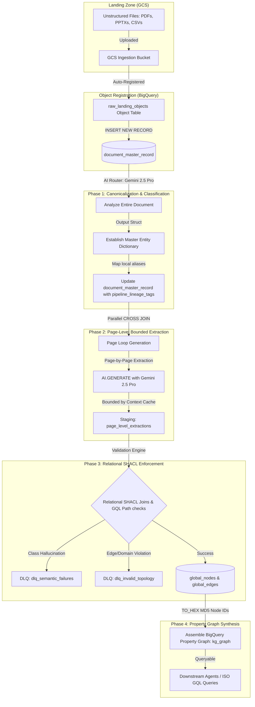
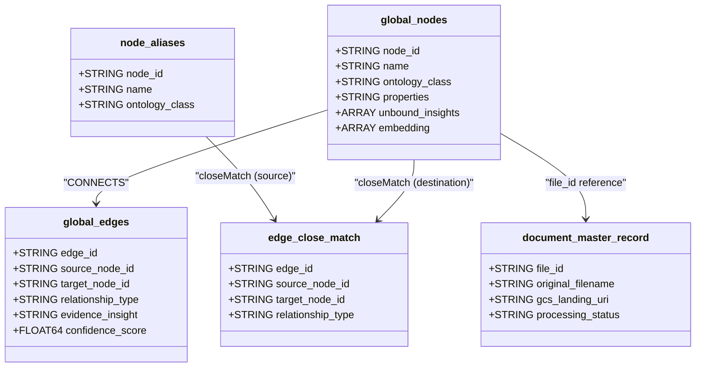
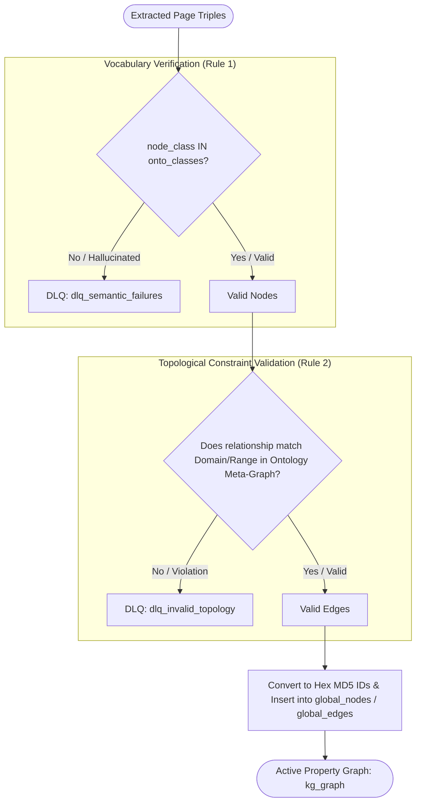

# Data Pipeline, Relational SHACL Ingestion & Property Graph Architecture

This document provides a comprehensive breakdown of the reference data architecture, detailing how unstructured scientific files are ingested, canonicalized, parsed into semantic primitives, relationally validated against an ontologically defined rule set, and structured as a queryable **Virtual Labeled Property Graph (LPG)**.

It also highlights the critical engineering **learnings** and **design decisions** that explain why this architecture succeeds over other industry alternatives.

---

## 1. Why This Architecture Works Over Alternatives (Comparative Analysis)

### The Real-World Challenge: Heterogeneous Scientific Documents at Scale
When dealing with pharmaceutical and Chemical Manufacturing and Control (CMC) research and development, organizations possess massive, high-value backlogs:
*   **Massive Historical Scale:** Over 30 years of laboratory and manufacturing logs, representing 50,000 to 100,000 multi-page documents.
*   **Extreme Document Length:** Files average 75 to 100+ pages, containing complex multi-modal information (images, tables, text).
*   **Wild Structural Heterogeneity:** No two scientists write their reports in the same format. For instance, solubility experiments, chromatography charts (HPLC), or polymorph screens exhibit completely different layouts, naming styles, and parameters.
*   **Semantic Synonym Ambiguity:** Shorthand names (e.g., `THF`), spelling variations, and chemical lot numbers (e.g., `Lot:Alpha-123`) are used interchangeably, threatening to fracture standard graph databases.

Traditional approaches fail catastrophically under these conditions. The table below contrasts this native Google Cloud/BigQuery architecture against common industry alternatives, including pure Vector RAG, LLM-First Middleware Graph Builders (e.g., the Yahoo pattern), and External Graph Databases (e.g., Neo4j/TypeDB).

| Architectural Dimension | Alternative A: Pure Vector RAG (Semantic Search) | Alternative B: LLM-First Graph & Middleware Validation | Alternative C: External Graph DBs (e.g., Neo4j / TypeDB) | This Architecture: Native BQ/Dataform + Relational SHACL |
| :--- | :--- | :--- | :--- | :--- |
| **Data Quality & Hallucination Control** | **Low.** Pure vector search is "fuzzy." It often confuses structurally dissimilar entities with similar embeddings (e.g., HPLC data vs Polymorph screen results). | **Medium.** Validating graph topology inside LLM prompts (e.g., instructing the LLM to follow rules) degrades quickly under complex, multi-class ontologies. | **Variable.** Relies entirely on the quality of external parser scripts. Does not have native integration to run parallel, multi-page relational validation. | **High (Deterministic).** Decouples extraction (LLM) from validation (SQL/GQL). Invalid structures are rejected immediately at the database level and routed to a Dead-Letter Queue. |
| **Scalability & Backlog Throughput** | **Medium.** Standard chunk-and-embed pipelines can scale, but lose the structural linkages needed for deep relational scientific queries. | **Low.** Running python-based extraction middleware (like LangChain/LlamaIndex) on local VMs to process 100k+ multi-page documents frequently triggers OOMs and network timeouts. | **Low to Medium.** Moving raw data from enterprise data warehouses to external graph databases via ETL pipelines creates heavy sync lag and ingestion bottlenecks. | **High.** Natively scales. Leverages BigQuery Object Tables and parallel loops to batch-process files, or runs asynchronous **Vertex AI Batch Prediction** to ingest millions of documents. |
| **Ontology Constraint Scaling** | **N/A.** No native concept of semantic ontology bounds or relationships. | **Low.** Standard `.owl` ontologies routinely exceed 100k lines. Injecting these into the LLM context window saturates attention and degrades instruction-following. | **High (Schema-heavy).** Excellent at holding graph schema but requires writing custom OWL-to-GDB schema translators and loading them into a separate engine. | **High.** Compiles the massive XML ontology into flat relational BigQuery tables. The LLM only receives a light, distilled markdown guide, while strict checks are done via database joins and GQL traversals. |
| **Data Warehouse Integration & Cost** | **Low Cost.** Standard embedding and retrieval are relatively inexpensive, but lack advanced semantic synthesis. | **Extremely High.** Sending entire multi-page documents repeatedly to the LLM to extract isolated page data burns through millions of redundant tokens. | **High Cost & High Overhead.** Requires maintaining a separate database cluster, incurring double storage, complex network configurations, and disjointed security/governance models. | **Low to Medium.** Runs completely in-place. Eliminates ETL pipelines, and splitting PDFs physically in GCS ensures Gemini only processes the exact single page needed, reducing token overhead. |

---

## 2. End-to-End Ingestion & Processing Flow

The pipeline operates as a serverless, database-driven extraction and orchestration workflow entirely hosted within Google Cloud. By combining **BigQuery Object Tables**, **Dataform**, and **Gemini 2.5 Pro**, it bypasses the need for fragile external orchestration middleware.



### Steps in Detail:
1. **Object Registration:** Unstructured files (such as experimental PDFs or CSV inventory records) deposited into GCS are automatically visible as database rows in the `raw_landing_objects` Object Table via Cloud Storage connections.
2. **AI Router & Master Dictionary:** For every new document, an initial high-level `AI.GENERATE` call scans the document. It generates a summary, classifies the file type (e.g., `SOP`, `Experiment_Report`), and constructs a document-level **Master Entity Dictionary** mapping localized abbreviations and aliases (e.g. `THF` or `Lot-1234`) to their canonical systematic names. This is saved directly into `document_master_record.pipeline_lineage_tags`.
3. **Chunked Extraction:** Dataform executes a parallel page-by-page extraction loop. The prompt passed to Gemini is tightly bounded by the Master Entity Dictionary and the distilled ontology schema. To save tokens and cost, a Vertex AI Context Cache of the ontology is injected natively.
4. **Relational Synthesis:** Extracted node and edge arrays are flattened. They are not inserted directly into the production graph; instead, they undergo a series of strict relational checks against the materialized ontology tables in BigQuery.

---

## 3. The Virtual Labeled Property Graph (LPG) Topology

The physical data is dumped into flat, generic tables to support unstructured, highly variable data inputs. However, to afford generative AI agents a highly predictable, strongly typed search target, the pipeline implements a **Virtual LPG** architecture.



### The LPG Schema Design (`kg_graph.sqlx`):
*   **The Flat Triple Store:** Nodes (`global_nodes`) and relationship edges (`global_edges`) form a generic triple-store layer. Unbound insights (conclusions or observations that do not fit a specific ontological edge) are safely captured as a JSON array (`unbound_insights`) inside the node to preserve tacit knowledge without breaking graph compliance.
*   **The Synonym Resolution Pattern:** When laboratory documents use aliases, they are not merged directly into the canonical nodes (which would cause "graph fracturing"). Instead:
    1. A separate `node_aliases` node is spawned with the label `:Alias`.
    2. An edge is created in the `edge_close_match` table with the label `:closeMatch`, connecting the `Alias` node directly to the standard canonical `global_nodes` node.
*   **The Native Property Graph DDL:**
    ```sql
    CREATE OR REPLACE PROPERTY GRAPH kg_graph
      NODE TABLES (
        global_nodes KEY(node_id),
        document_master_record KEY(file_id),
        node_aliases KEY(node_id) LABEL Alias
      )
      EDGE TABLES (
        global_edges KEY(edge_id)
          SOURCE KEY(source_node_id) REFERENCES global_nodes(node_id)
          DESTINATION KEY(target_node_id) REFERENCES global_nodes(node_id)
          LABEL CONNECTS,
        edge_close_match KEY(edge_id)
          SOURCE KEY(source_node_id) REFERENCES node_aliases(node_id)
          DESTINATION KEY(target_node_id) REFERENCES global_nodes(node_id)
          LABEL closeMatch
      );
    ```

---

## 4. Relational SHACL Ontology Enforcement

Treating LLM extraction output as "untrusted data" is fundamental to maintaining topological integrity. Rather than relying on the LLM to follow complex domain/range rules, Dataform executes strict relational validations using BigQuery's SQL and GQL engines.



### SHACL Rule 1: Class Vocabulary Validation
We block the insertion of any node whose `ontology_class` was hallucinated by the LLM and does not exist in our master class registry.
*   **The Join:** An `INNER JOIN` matches extracted nodes to the `onto_classes` table.
*   **The DLQ Routing:** Unmatched nodes are directed straight into the `dlq_semantic_failures` table.

```sql
-- Filtering hallucinated classes
SELECT file_id, page_num, node_name, ontology_class AS hallucinated_class, properties
FROM unnested_nodes u
WHERE TRIM(u.ontology_class) NOT IN (SELECT class_name FROM onto_classes);
```

### SHACL Rule 2: Edge Topology & Subclass Path Validation
For every extracted relationship edge (e.g. `SourceNode -[Relationship]-> TargetNode`), the pipeline verifies if the source node's class matches the defined `domain` of that relationship, and if the target node's class matches the defined `range`. 

Because relationships can be inherited transitively, the pipeline queries the **Ontology Meta-Graph** using a **Quantified Path Pattern** (up to 5 levels deep in the subclass hierarchy) to verify compliance:

```sql
-- Validating Edge Domain and Range against Ontology Meta-Graph
SELECT e.*
FROM edges_with_classes e
WHERE EXISTS (
  SELECT 1 FROM GRAPH_TABLE(kg_ontology.master_graph
    MATCH 
      -- Traverse up the subclass tree to check inherited domains & ranges
      (sc:Class) (-[:SUBCLASS_OF]->){0, 5} (domain:Class),
      (tc:Class) (-[:SUBCLASS_OF]->){0, 5} (`range`:Class),
      (p:Property)-[:DOMAIN]->(domain),
      (p)-[:RANGE]->(`range`)
    WHERE sc.label = e.source_class
      AND tc.label = e.target_class
      AND p.label = e.relationship_type
  )
);
```
*   **Validation Failure:** Any extracted edge that violates these strict inheritance rules is isolated and pushed to the `dlq_invalid_topology` table.
*   **Validation Success:** Compliance-checked edges are assigned UUIDs, deduplicated via MD5 hashing, and written to `global_edges` for indexing.

---

## 5. Major Engineering Learnings & Design Principles

Over five weeks of architectural prototyping and scaling iterations, several critical engineering lessons emerged from deploying this system in a highly precise, regulated scientific domain:

### 1. Hybrid GQL + Vector Queries Prevent Hallucinations
A classic vector-search (semantic search) query excels at locating general matching regions of text. However, when a scientist asks a precise question (e.g., *"Retrieve the HPLC calibration standards used for Lot-409"*), semantic similarity often surfaces unrelated HPLC reports that share nearby vector space.
*   **Our Solution:** The final query engine uses a **Hybrid GQL + Vector Search** query. BigQuery first enforces exact relational bindings using GQL (e.g. mapping `(l:Lot {name: 'Lot-409'})-[:tested_in]->(e:Experiment)`), and then applies the vector search *only* on the filtered subsets. This guarantees that only files explicitly tied to the target molecule or experiment are considered.

### 2. Context Caching is Mandatory for Complex Ontologies
Standard ontology files (like `kg.owl` or `cmc.owl`) are bloated with XML/RDF metadata, rendering them too large to be fed directly into standard LLM prompts without attention decay and high latencies.
*   **Our Solution:** We compiled the ontology down into a simplified, structural markdown format (~140KB) that details class definitions, relationship ranges, and allowed properties. This distilled representation is bound directly to a stateful, 60-minute **Vertex AI Context Cache** inside BigQuery. This approach drastically decreases processing time and slashes input token billing by over 80%.

### 3. Physical Page Chunking Overcomes "Lost-In-The-Middle" Attention
In early POCs, feeding entire multi-page documents to Gemini and asking for page-level extractions resulted in the model skipping pages near the middle of large files (a documented symptom of LLM attention decay over large contexts).
*   **Our Solution:** The production pipeline physically splits multi-page PDFs in GCS into separate single-page documents prior to running `AI.GENERATE`. This ensures Gemini's attention is focused exclusively on the target page, guaranteeing 100% extraction coverage across large 100+ page laboratory logs.

### 4. The "Two-Graph" Separation (Data Graph vs. Metadata Graph) for Dynamic Inheritance
One of the most powerful insights from our discussions with Google Graph engineers was the decoupling of the **Data Graph** from the **Ontology Metadata Graph**.
*   **The Learning:** Forcing the LLM or query engines to hardcode all subClassOf and relationship inheritance paths results in massive schema brittleness. By loading the OWL definitions into a parallel metadata graph in BigQuery, we can write ISO GQL queries with Quantified Path Patterns (e.g. `(source_class) (-[:SUBCLASS_OF]->){0, 5} (valid_domain)`) to resolve inheritance dynamically at query/validation time. The extraction logic remains simple and static, while the database dynamically resolves complex taxonomic rules.

### 5. Physical Ingestion Chunking vs. Virtual Sequence Loops (Performance & Cost Disparity)
During the pipeline alignment analysis, we identified a critical performance disparity between the initial public release prototype and the main production pipeline:
*   **The Issue:** The virtual sequence loop (generating an array in SQL and passing the full multi-page PDF to `AI.GENERATE` repeatedly while prompting Gemini to read page-by-page) is mathematically elegant in SQL, but behaves as an anti-pattern under volume. It repeatedly pushes massive, redundant document contexts into the API, causing token cost explosions and severe Vertex AI rate-limiting throttles.
*   **The Learning:** Implementing a pre-processing Remote Function that physically splits PDFs in GCS into single-page assets prior to model calls reduces input token volume by over 90%, reduces processing latency, and ensures high-throughput scalability.

### 6. Synonyms and Aliases must be First-Class Graph Entities (The SKOS Pattern)
In chemical manufacturing, raw compounds and batches are referred to by various names: abbreviations (e.g., `THF`), systematic names (`Tetrahydrofuran`), or lot numbers (`Lot-A`). Trying to force the LLM to unify these syntactically during extraction causes severe hallucination or fractures the graph.
*   **Our Solution:** We implemented the **SKOS closeMatch Pattern** within our Virtual LPG. Original names are extracted exactly as written and represented as `:Alias` nodes, connected to their validated, canonical nodes via `:closeMatch` edges. This keeps the graph mathematically clean, maintains strict compliance with raw experimental records, and enables downstream search agents to perform semantic expansion queries effortlessly:
    ```sql
    MATCH (a:Alias {name: 'Lot-1234'})-[:closeMatch]->(m:Molecule)
    ```
